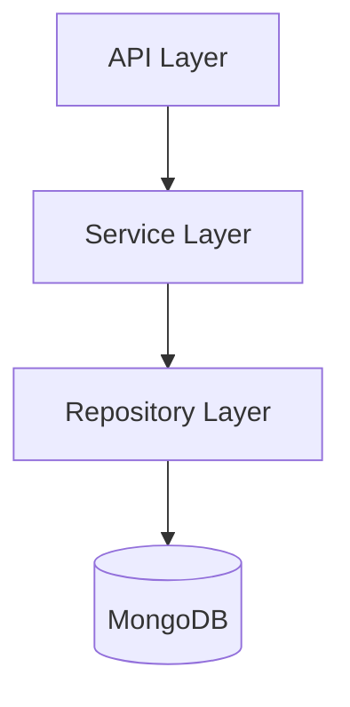

# /design - System and Component Design

## Triggers

- Architecture planning and system design requests
- API specification and interface design needs
- Component design and technical specification requirements
- Database schema and data model design requests
- New feature architectural planning

## Usage

```
/design <target> [--type architecture|api|component|database] [--format diagram|spec|code]
```

**Examples:**
- `/design user-management --type architecture` - System architecture
- `/design /api/v1/resources --type api --format spec` - API specification
- `/design NotificationService --type component --format code` - Component interface
- `/design agent-registry --type database --format diagram` - Database schema

## Behavioral Flow

1. **Analyze**: Examine target requirements and existing system context
2. **Research**: Review existing patterns in codebase and project conventions
3. **Design**: Create comprehensive specifications following project patterns
4. **Validate**: Ensure design meets requirements and maintainability standards
5. **Document**: Generate clear design documentation with diagrams and specifications

Key behaviors:
- Requirements-driven design with scalability considerations
- Project pattern compliance (FastAPI, Pydantic, Repository pattern)
- Multi-format output (diagrams, specifications, code interfaces)
- Validation against existing architecture and conventions

## MCP Integration

- **Serena MCP**: Codebase pattern analysis and existing design review
  - `get_symbols_overview`: Understand existing structures
  - `find_symbol`: Find similar implementations
  - `search_for_pattern`: Identify design patterns used

## Tool Coordination

- **Read**: Requirements analysis and existing design examination
- **Grep/Glob**: Pattern analysis and system structure investigation
- **Write**: Design documentation generation

## Design Types

### Architecture Design (`--type architecture`)

Design system-level architecture with components and relationships.

**Deliverables:**
- Component diagram (Mermaid)
- Layer responsibilities
- Integration points
- Data flow description

**Template:**
```markdown
## Architecture Design: [Feature Name]

### Overview
[High-level description]

### Component Diagram


### Components
| Component | Responsibility | Dependencies |
|-----------|---------------|--------------|
| [Name] | [Purpose] | [Dependencies] |

### Data Flow
1. Request → API endpoint
2. Validation → Pydantic schema
3. Business logic → Service
4. Persistence → Repository
5. Response → API

### Integration Points
- [External system integration details]
```

### API Design (`--type api`)

Design RESTful API endpoints following FastAPI patterns.

**Deliverables:**
- Endpoint specifications
- Request/response schemas
- Error responses
- Authentication requirements

**Template:**
```markdown
## API Design: [Endpoint Group]

### Endpoints

#### POST /api/v1/resources
**Purpose**: Create new resource

**Request Body:**
```python
class ResourceCreate(BaseModel):
    name: str = Field(..., min_length=1, max_length=100)
    description: str | None = None
```

**Response (201):**
```python
class ResourceResponse(BaseModel):
    id: str
    name: str
    created_at: datetime
```

**Error Responses:**
- 400: Validation error
- 401: Unauthorized
- 409: Resource already exists

**Authentication**: Required (OAuth2 Bearer)
```

### Component Design (`--type component`)

Design service or component interfaces.

**Deliverables:**
- Class/interface definition
- Method signatures
- Dependencies
- Usage examples

**Template:**
```python
class ResourceService:
    """Service for managing resources.

    Handles business logic for resource CRUD operations.
    """

    def __init__(
        self,
        repository: ResourceRepository,
        event_publisher: EventPublisher | None = None,
    ) -> None:
        """Initialize service with dependencies."""
        self._repository = repository
        self._event_publisher = event_publisher

    async def create(
        self,
        data: ResourceCreate,
        user_id: str,
    ) -> Resource:
        """Create a new resource.

        Args:
            data: Resource creation data
            user_id: ID of user creating resource

        Returns:
            Created resource

        Raises:
            ResourceExistsError: If resource with name already exists
        """
        ...
```

### Database Design (`--type database`)

Design database schemas and data models.

**Deliverables:**
- Collection/table structure
- Indexes
- Relationships
- Migration considerations

**Template:**
```markdown
## Database Design: [Collection Name]

### Collection: resources

**Document Structure:**
```json
{
  "_id": "ObjectId",
  "name": "string",
  "description": "string | null",
  "owner_id": "string",
  "created_at": "datetime",
  "updated_at": "datetime",
  "metadata": {}
}
```

### Indexes
| Index | Fields | Type | Purpose |
|-------|--------|------|---------|
| name_unique | name | unique | Prevent duplicates |
| owner_idx | owner_id | standard | Query by owner |
| created_idx | created_at | standard | Sort by creation |

### Relationships
- `owner_id` → users._id (reference)

### Migration Notes
- Add index before bulk insert
- Consider TTL for temporary data
```

## Key Patterns

- **Architecture Design**: Requirements → component structure → integration planning
- **API Design**: Interface specification → schema design → documentation
- **Component Design**: Responsibilities → interface design → dependency injection
- **Database Design**: Data requirements → schema design → index optimization

## Output Formats

### Diagram (`--format diagram`)
- Mermaid diagrams for architecture visualization
- Entity-relationship diagrams for database
- Sequence diagrams for flows

### Specification (`--format spec`)
- Markdown documentation with detailed specifications
- OpenAPI-style endpoint documentation
- Interface contracts

### Code (`--format code`)
- Python interface definitions with type hints
- Pydantic model stubs
- FastAPI route stubs

## Examples

### System Architecture Design
```
/design user-management-system --type architecture --format diagram
# Creates comprehensive system architecture with component relationships
# Includes scalability considerations and integration patterns
```

### API Specification Design
```
/design /api/v1/agents --type api --format spec
# Generates detailed API specification with endpoints and schemas
# Follows FastAPI/Pydantic patterns from existing codebase
```

### Component Interface Design
```
/design AgentDiscoveryService --type component --format code
# Designs component interface with clear contracts
# Provides implementation guidance with dependency injection
```

### Database Schema Design
```
/design agent-capabilities --type database --format diagram
# Creates database schema with indexes and relationships
# Includes migration considerations
```

## Boundaries

**Will:**
- Create comprehensive design specifications with project pattern compliance
- Generate multiple format outputs (diagrams, specs, code) based on requirements
- Validate designs against maintainability and scalability standards
- Reference existing codebase patterns for consistency

**Will Not:**
- Generate actual implementation code (use /implement for implementation)
- Modify existing system architecture without explicit design approval
- Create designs that violate established architectural constraints
- Skip validation against existing patterns and conventions
