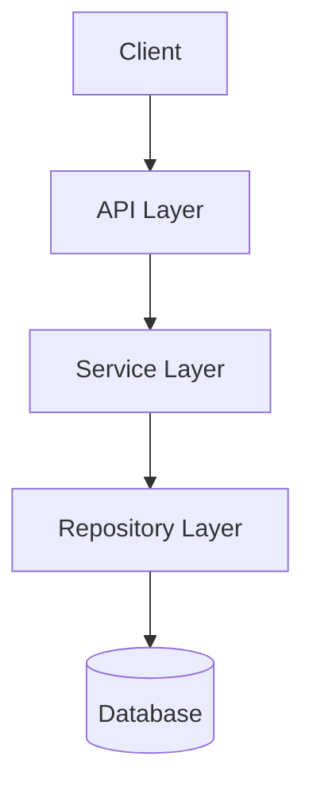

# /explain - Code & Concept Explanation

## Triggers

- Understanding unfamiliar code or components
- Onboarding to new parts of the codebase
- Documenting system behavior
- Teaching or knowledge transfer
- Architecture comprehension needs

## Usage

```
/explain <target> [--depth overview|detailed|deep] [--format text|diagram|example]
```

**Examples:**
- `/explain registry/services/server_service.py` - Explain a file
- `/explain "authentication flow" --depth detailed` - Explain a concept
- `/explain registry/api/ --format diagram` - Explain with diagrams
- `/explain ServerService.create --depth deep --format example` - Deep dive with examples

## Behavioral Flow

1. **Identify**: Determine target scope (file, function, concept)
2. **Analyze**: Use Serena tools to understand code structure
3. **Structure**: Organize explanation by depth level
4. **Present**: Format output for clarity and comprehension
5. **Illustrate**: Add diagrams or examples as needed

Key behaviors:
- Audience-appropriate explanations
- Progressive depth (overview -> details)
- Concrete examples for abstract concepts

## MCP Integration

- **Serena MCP**: Code structure analysis
  - `get_symbols_overview`: File structure understanding
  - `find_symbol`: Locate specific code
  - `find_referencing_symbols`: Trace relationships
  - `search_for_pattern`: Find usage patterns

## Tool Coordination

- **Serena Tools**: Symbolic analysis, dependency tracing
- **Read**: Code content for detailed analysis
- **Grep/Glob**: Find related files and patterns
- **Write**: Documentation output

## Explanation Depths

### Overview (--depth overview)

High-level understanding:
- What does it do?
- Why does it exist?
- How does it fit in the system?

### Detailed (--depth detailed)

Implementation understanding:
- Key components and their roles
- Data flow through the system
- Important design decisions
- Configuration options

### Deep (--depth deep)

Complete comprehension:
- Line-by-line analysis where needed
- Edge cases and error handling
- Performance characteristics
- Security considerations
- Testing strategies

## Output Formats

### Text (--format text)

Standard prose explanation with code snippets.

### Diagram (--format diagram)

Mermaid diagrams for visual understanding:



### Example (--format example)

Working code examples demonstrating usage:

```python
# Example: Creating a server
from registry.services.server_service import ServerService

server = await service.create(
    ServerCreate(name="my-server", url="http://localhost:8080")
)
```

## Explanation Process

### Step 1: Scope Identification

Determine what needs explanation:
- Single function/class
- File or module
- System concept
- Architecture pattern

### Step 2: Context Gathering

Use Serena tools:

```text
get_symbols_overview: Understand structure
find_symbol: Locate specific code
find_referencing_symbols: Find callers/dependencies
```

### Step 3: Structure Building

Organize by:
- Purpose (what and why)
- Components (what parts)
- Flow (how it works)
- Interfaces (how to use it)

### Step 4: Presentation

Format appropriately:
- Clear headings
- Code snippets with context
- Diagrams where helpful
- Examples for complex concepts

## Output Format

```markdown
## Explanation: {Target}

### Overview
{One paragraph summary of what this is and why it exists}

### Purpose
{What problem does it solve? What role does it play?}

### How It Works

#### Components
{Key parts and their responsibilities}

#### Data Flow
{How data moves through the component}

```mermaid
{diagram if --format diagram}
```

### Key Concepts

#### {Concept 1}
{Explanation}

```python
# Example
{code example if --format example}
```

#### {Concept 2}
{Explanation}

### Usage Examples

```python
# Basic usage
{example code}

# Advanced usage
{example code}
```

### Related Components
- `{related_file_1}`: {relationship}
- `{related_file_2}`: {relationship}

### Common Questions

**Q: {Likely question}**
A: {Answer}

### Further Reading
- {Related documentation}
- {External resources if applicable}
```

## Example Explanations

### Explaining a Service

```markdown
## ServerService

The ServerService handles all business logic for MCP server management.
It sits between the API layer (which handles HTTP concerns) and the
repository layer (which handles persistence).

### Key Methods

- `create(data)`: Register a new MCP server
- `get(id)`: Retrieve server by ID
- `list()`: Get all registered servers
- `update(id, data)`: Modify server configuration
- `delete(id)`: Remove a server

### Dependencies

- `ServerRepository`: Data persistence
- `EventPublisher`: Notification events
```

### Explaining a Flow

```markdown
## Authentication Flow

When a request arrives:

1. **Token Extraction**: JWT extracted from Authorization header
2. **Validation**: Token signature verified against Keycloak public key
3. **Claims Parsing**: User identity and scopes extracted
4. **Authorization**: Request scope checked against required permissions
5. **Context Injection**: User context made available to handlers
```

## Boundaries

**Will:**
- Provide clear, accurate explanations at requested depth
- Use appropriate format (text, diagram, example)
- Trace dependencies and relationships
- Include practical usage examples

**Will Not:**
- Explain code without actually reading it
- Provide inaccurate or speculative explanations
- Skip context that's essential for understanding
- Overwhelm with unnecessary detail at overview level
