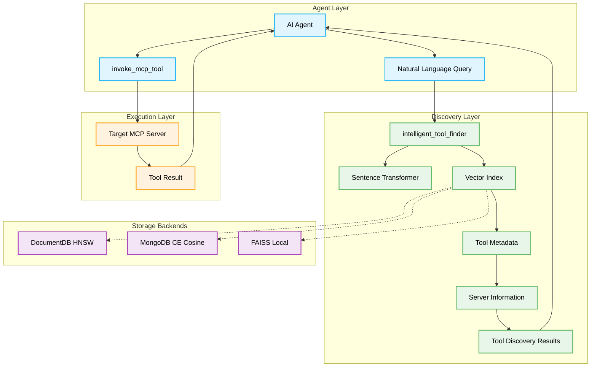

# Dynamic Tool Discovery and Invocation

The MCP Gateway & Registry provides a powerful **Dynamic Tool Discovery and Invocation** feature that enables AI agents to autonomously discover and execute tools beyond their initial capabilities. This feature uses advanced semantic search with sentence transformers and vector similarity indexing to intelligently match natural language queries to the most relevant MCP tools across all registered servers.

The system supports multiple storage backends:

- **DocumentDB (AWS)**: Uses native HNSW vector indexes for high-performance similarity search
- **MongoDB CE**: Falls back to client-side cosine similarity calculation
- **File-based storage**: Uses FAISS (Facebook AI Similarity Search) for local deployments

## Table of Contents

- [Overview](#overview)
- [How It Works](#how-it-works)
- [Architecture](#architecture)
- [Usage Examples](#usage-examples)
- [Agent Integration](#agent-integration)
- [API Reference](#api-reference)
- [Technical Implementation](#technical-implementation)
- [Demo](#demo)

## Overview

Traditional AI agents are limited to the tools they were initially configured with. The Dynamic Tool Discovery feature breaks this limitation by allowing agents to:

1. **Discover new tools** through natural language queries
2. **Automatically find** the most relevant tools from hundreds of available MCP servers
3. **Dynamically invoke** discovered tools without prior configuration
4. **Expand capabilities** on-demand based on user requests

This enables agents to handle tasks they weren't originally designed for, making them truly adaptive and extensible.

## How It Works

The dynamic tool discovery process follows these steps:

1. **Natural Language Query**: Agent receives a user request requiring specialized capabilities
2. **Semantic Search**: The `intelligent_tool_finder` tool processes the query using sentence transformers
3. **Vector Index Search**: Searches through embeddings of all registered MCP tools using the configured backend (DocumentDB HNSW, MongoDB CE cosine similarity, or FAISS)
4. **Hybrid Ranking**: Returns tools ranked by a combination of semantic similarity and keyword matching
5. **Tool Invocation**: Agent uses the discovered tool information to invoke the appropriate MCP tool


## Architecture

### Components



### Key Technologies

- **Sentence Transformers**: Neural network models for semantic text understanding (default: `all-MiniLM-L6-v2`)
- **Vector Similarity Search**: Multiple backend support:
    - **DocumentDB HNSW**: Native hierarchical navigable small world indexes for AWS deployments
    - **MongoDB CE**: Client-side cosine similarity for community edition deployments
    - **FAISS**: Facebook AI Similarity Search for file-based local deployments
- **Hybrid Search**: Combines vector similarity with keyword matching for improved relevance
- **Cosine Similarity**: Mathematical measure of semantic similarity between queries and tools
- **MCP Protocol**: Standardized communication with tool servers

## Usage Examples

Dynamic tool discovery can be used in two primary ways:

### 1. Direct Developer Usage

Agent developers can directly call the `intelligent_tool_finder` in their code to discover tools, then use the results with the `invoke_mcp_tool` function to call the discovered tool.

#### Basic Discovery

When using `intelligent_tool_finder` via MCP, authentication is handled automatically through the MCP context:

```python
# Basic usage via MCP (authentication handled automatically)
tools = await intelligent_tool_finder(
    natural_language_query="what time is it in Tokyo"
)

# Returns information about relevant tools:
# [
#   {
#     "tool_name": "current_time_by_timezone",
#     "service_path": "/currenttime",
#     "service_name": "Current Time Server",
#     "tool_schema": {...},
#     "overall_similarity_score": 0.89
#   }
# ]
```

#### Advanced Discovery

```python
# Advanced usage with tag filtering and multiple results
tools = await intelligent_tool_finder(
    natural_language_query="stock market information and financial data",
    tags=["finance", "market"],  # Optional: only use if user explicitly provides tags
    top_k_services=5,
    top_n_tools=3
)
```

#### Complete Workflow (Agent Framework)

When using the Python agent framework in `agents/`, use `search_registry_tools` and `invoke_mcp_tool`:

```python
# 1. Discover tools for weather information
weather_tools = await search_registry_tools(
    query="weather forecast for tomorrow",
    max_results=3
)

# 2. Use the discovered tool
if weather_tools:
    tool_info = weather_tools[0]  # Get the best match

    result = await invoke_mcp_tool(
        mcp_registry_url="https://your-registry.com/mcpgw/sse",
        server_name=tool_info["server_path"],  # e.g., "/weather"
        tool_name=tool_info["tool_name"],      # e.g., "get_forecast"
        arguments={"location": "New York", "days": 1}
    )
```

**Note:** Authentication is configured via the agent settings and applied automatically.

### 2. Agent Integration

The more powerful approach is when AI agents themselves use dynamic tool discovery autonomously. The agent has access to both `intelligent_tool_finder` and `invoke_mcp_tool` as available tools, allowing it to discover and execute new capabilities on-demand.

**Demo Video**: [Watch the agent integration in action](https://github.com/user-attachments/assets/cee1847d-ecc1-406b-a83e-ebc80768430d)

#### System Prompt Configuration

Agents are configured with instructions on how to use dynamic tool discovery:

```text
<tool_discovery>
When a user requests something that requires a specialized tool you don't have direct access to, use the intelligent_tool_finder tool.

How to use intelligent_tool_finder:
1. When you identify that a task requires a specialized tool (e.g., weather forecast, time information, etc.)
2. Call the tool with a description of what you need: `intelligent_tool_finder("description of needed capability")`.
3. The tool will return the most appropriate specialized tool along with usage instructions
4. You can then use the invoke_mcp_tool to invoke this discovered tool by providing the MCP Registry URL, server name, tool name, and required arguments

Example workflow:
1. Discover a tool: result = intelligent_tool_finder("current time timezone")
2. The result provides details about a time tool on the "currenttime" MCP server.
3. Always use the "service_path" path field for the server name while creating the arguments for the invoke_mcp_tool in the next step.
4. Use invoke_mcp_tool to call it with ALL required auth parameters
</tool_discovery>
```

#### Agent Implementation

The agent implementation in [`agents/agent.py`](../agents/agent.py) shows how to:

1. **Load MCP tools** from the registry
2. **Combine built-in and discovered tools**
3. **Handle authentication** for both session cookie and M2M methods
4. **Process tool discovery results**

Key code snippet:

```python
# Get available tools from MCP and display them
mcp_tools = await client.get_tools()
logger.info(f"Available MCP tools: {[tool.name for tool in mcp_tools]}")

# Add the calculator and invoke_mcp_tool to the tools array
# The invoke_mcp_tool function already supports authentication parameters
all_tools = [calculator, invoke_mcp_tool] + mcp_tools
logger.info(f"All available tools: {[tool.name if hasattr(tool, 'name') else tool.__name__ for tool in all_tools]}")

# Create the agent with the model and all tools
agent = create_react_agent(model, all_tools)
```

This integration enables agents to have **limitless capabilities** - they can handle any task for which there's an appropriate MCP tool registered in the system, even if they weren't originally programmed with knowledge of that tool.

## API Reference

### intelligent_tool_finder

Finds the most relevant MCP tool(s) across all registered and enabled services based on a natural language query and/or tag filtering.

#### Parameters

| Parameter | Type | Required | Description |
|-----------|------|----------|-------------|
| `natural_language_query` | `str` | No* | Your query in natural language describing the task you want to perform |
| `tags` | `list[str]` | No* | List of tags to filter tools by using AND logic. Only use if user explicitly provides tags |
| `top_k_services` | `int` | No | Number of top services to consider from initial vector search (default: 3) |
| `top_n_tools` | `int` | No | Number of best matching tools to return (default: 1) |

*Either `natural_language_query` OR `tags` (or both) must be provided.

**Note:** When accessed via MCP, authentication is handled automatically through the MCP context.

#### Returns

```python
List[Dict[str, Any]]
```

A list of dictionaries, each describing a recommended tool:

```python
[
    {
        "tool_name": "current_time_by_timezone",
        "tool_parsed_description": {
            "main": "Get current time for a specific timezone",
            "parameters": {...}
        },
        "tool_schema": {
            "type": "object",
            "properties": {...}
        },
        "service_path": "/currenttime",
        "service_name": "Current Time Server",
        "overall_similarity_score": 0.89
    }
]
```

#### Example Usage

```python
# Basic usage with natural language query
tools = await intelligent_tool_finder(
    natural_language_query="what time is it in Tokyo"
)

# Advanced usage with multiple results and tag filtering
tools = await intelligent_tool_finder(
    natural_language_query="stock market information and financial data",
    tags=["finance"],  # Only use if user explicitly provides tags
    top_k_services=5,
    top_n_tools=3
)

# Pure tag-based filtering (when user provides tags without a query)
tools = await intelligent_tool_finder(
    tags=["database", "analytics"],
    top_n_tools=10
)
```

## Technical Implementation

### Vector Index Creation

The registry automatically creates and maintains a vector index of all registered MCP tools. The index type depends on the configured storage backend:

| Backend | Index Type | Description |
|---------|------------|-------------|
| **DocumentDB** | HNSW | Native hierarchical navigable small world index with cosine similarity |
| **MongoDB CE** | Client-side | In-memory cosine similarity calculation (fallback for CE) |
| **File-based** | FAISS | Facebook AI Similarity Search for local deployments |

**Index Creation Process:**

1. **Tool Metadata Collection**: Gathers tool descriptions, schemas, and server information
2. **Text Embedding**: Uses sentence transformers to create vector embeddings
3. **Index Building**: Constructs appropriate index based on storage backend
4. **Automatic Updates**: Refreshes index when servers are added/modified

### Hybrid Search Process

The system uses a hybrid search approach combining vector similarity with keyword matching:

```python
# 1. Embed the natural language query
query_embedding = model.encode([query])[0].tolist()

# 2. Perform vector search (backend-specific)
# DocumentDB: Native $vectorSearch aggregation
# MongoDB CE: Client-side cosine similarity
# FAISS: faiss_index.search()

# 3. Calculate text-based boost for keyword matches
text_boost = 0.0
if query_token in doc["path"]:
    text_boost += 5.0  # Strong boost for path matches
if query_token in doc["name"]:
    text_boost += 3.0  # Moderate boost for name matches
if query_token in doc["description"]:
    text_boost += 2.0  # Description match boost
if query_token in doc["tags"]:
    text_boost += 1.5  # Tag match boost

# 4. Combine vector similarity with keyword boost
normalized_vector_score = (vector_score + 1.0) / 2.0  # Normalize to [0, 1]
relevance_score = normalized_vector_score + (text_boost * 0.05)

# 5. Return ranked results
ranked_tools = sorted(tools_with_scores, key=lambda x: x["relevance_score"], reverse=True)
```

### Performance Optimizations

- **Lazy Loading**: Vector indexes and embedding models are loaded on-demand
- **Caching**: Embeddings and metadata are cached and reloaded only when data changes
- **Async Processing**: All embedding operations run in separate threads
- **Memory Efficiency**: Uses float32 precision for embeddings to reduce memory usage
- **Hybrid Ranking**: Combines semantic similarity with keyword matching for better relevance

### Model Configuration

The system uses configurable sentence transformer models:

```python
# Default model (lightweight, fast)
EMBEDDINGS_MODEL_NAME = 'all-MiniLM-L6-v2'  # 384 dimensions

# Model loading with caching
model_cache_path = _registry_server_data_path.parent / ".cache"
_embedding_model_mcpgw = SentenceTransformer(EMBEDDINGS_MODEL_NAME, cache_folder=model_cache_path)
```

## Demo

**Demo Video**: [Dynamic Tool Discovery and Invocation](https://github.com/user-attachments/assets/cee1847d-ecc1-406b-a83e-ebc80768430d)

### Example Interaction

**User Query**: "What's the current time in Tokyo?"

**Agent Process**:

1. Agent recognizes need for time information
2. Calls `intelligent_tool_finder("current time in Tokyo")`
3. Discovers `current_time_by_timezone` tool from `/currenttime` server
4. Invokes tool with `{"tz_name": "Asia/Tokyo"}`
5. Returns formatted time result

**Result**: "The current time in Tokyo is 2024-01-15 14:30:45 JST"

### Performance Metrics

*Coming soon.*

## Best Practices

### For Tool Developers

1. **Descriptive Names**: Use clear, descriptive tool names
2. **Rich Descriptions**: Provide detailed tool descriptions with use cases
3. **Proper Schemas**: Include comprehensive parameter schemas
4. **Consistent Naming**: Follow naming conventions for better discoverability

### For Agent Developers

1. **Specific Queries**: Use specific, descriptive queries for better matches
2. **Fallback Handling**: Implement fallbacks when no suitable tools are found
3. **Authentication**: Always include proper authentication parameters
4. **Error Handling**: Handle tool discovery and invocation errors gracefully

### For System Administrators

1. **Index Maintenance**: Monitor vector index updates and performance (backend-specific)
2. **Model Updates**: Consider updating sentence transformer models periodically
3. **Server Health**: Ensure registered servers are healthy and responsive
4. **Access Control**: Configure proper authentication and authorization
5. **Backend Selection**: Choose appropriate storage backend for your deployment:
    - **DocumentDB**: For AWS production deployments with native vector search
    - **MongoDB CE**: For self-hosted deployments (uses client-side search)
    - **File-based**: For local development and testing
